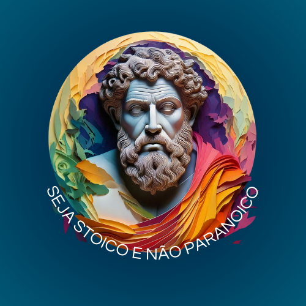

    preview do podcast

    <audio src="Podcast_Filo_mixagem.mp3" controls title="Podcast editado"></audio>

# Projeto Podcast Gerado por I.A.s

 > ℹ️ **NOTE:** Este é o repositório desenvolvido durante uma live no Youtube em parceria com a [DIO](https://dio.me)

Projeto com o objetivo de gerar um podcast utilizando ferramentas de IA através de prompts mais trabalhado.

Utilizado esteira de prompts para gerar cada etapa do processo criativo.

## 💻 Tecnologias utilizadas no projeto

- [ChatGPT](https://chat.openai.com/) 
- Adobe Express
- [ElevenLabs](https://beta.elevenlabs.io/)
- Adobe Audition

## ✨ Como foi feito ?

- Roteiro gerado via ChatGPT
- Audio gerado pela ElevenLabs
- Adobe Express para gerar capa
- Adobe Audition para tratar aúdio e adicionar sons de fundo

## 📚 Materiais

- [Link da live no Youtube](https://www.youtube.com)
- [Notion Template](https://helpful-jump-17b.notion.site/PAS-Podcast-AI-Studio-210489e15d7a4a73b743bb159e45d06f?pvs=4)
- [Editor de aúdio](https://www.capcut.com/editor?from_page=landing_page&__action_from=picture_V%C3%ADdeos%20profissionais%20em%20minutos,%20n%C3%A3o%20em%20horas.)

## 🛠️ Processo de execução

Utilizado os prompts dentro do link do `Notion` fornecido na parte de `Materiais` para criar um podcast de maneira automatizada, para isso foi realizado o passo a passo abaixo.

- 🤖 1. Prompts de roteiro no `ChaGPT`
- 🤖 2. Prompts de roteiro gerados pelo ChatGPT no  `ElevenLabs`
- 🤖 3. Prompts de artes no `Adobe Express`

## 👨‍💻 Aprendiz

    
    
&nbsp&nbsp&nbsp Mary  
    &nbsp&nbsp&nbsp
    <a 
        href="https://github.com/maryinthebox">
        GitHub
  
    
  
   
  

---

⌨️ com 💜 por [Mary](https://github.com/maryinthebox)# podcast
IA tools to create a podcast
